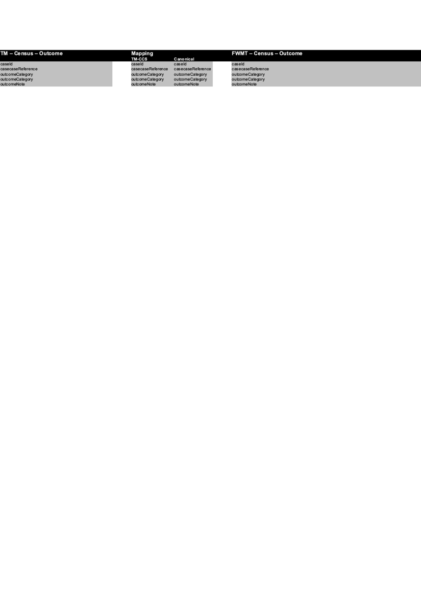

> **THIS REPO IS SEEDED FROM 2021 CODE AND AS SUCH CURRENTLY NEEDS MODERNISATION!** (see also [SEEDING.md](SEEDING.md).)
trigger

# census31-fwmt-outcome-service
This service is a gateway between Total Mobile's COMET interface and FWMTG outcome service.

It receives a JSON response from TM, transforms it into a FWMT Canonical and places the message onto the Gateway.Outcome RabbitMQ Queue

## Quick Start

Requires RabbitMQ to start:

	docker run --name rabbit -p 5671-5672:5671:5672 -p 15671-15672:15671-15672 -d rabbitmq:3.6-management

To run: 

    mvn spring-boot:run

## tm-outcome

## Copyright
Copyright (C) 2018 Crown Copyright (Office for National Statistics)
trigger 2
